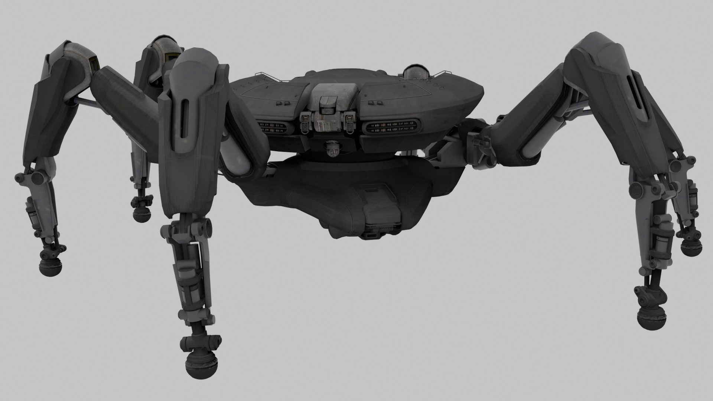

### [ This is no longer maintained by AstroVal0 ]
 - Main contributors
	- [Silarious](https://watch.silarious.online)
	- Teralix
	
Objects folder is all AstroVal0's work, for all uses of those assets please credit AstroVal0.

The .blend files have packed textures and are for versions 5.0 and above, There may be issues opening them on lower versions.

The goal is to have easy accessible assets for anyone to use.

**step 1, get NinjaRipper! I use version 2.12 you can pay 5$ for on their patreon.**

**step 2, fully close steam (right click in tray - press exit).**

**step 3, launch steam.exe through NinjaRipper**

**step 4, open the properties of arc raiders game in your steam library, add launch arg: '-nothreadtimeout' (this is because the game will hang for a fat min while it rips assets. so to make sure you gather as much as you can, you dont want a thread timeout)**

**step 5, just launch arc raiders as normal through steam**

**step 6, while in game - you can press your rip keys and change settings as needed to capture!**

**step optional 7, you can check PioneerGame.exe inside your rips folder after ripping for all models and textures, you will find any UI icons or images that were on screen at the time of the rip inside here as well.**

**step optional 8, when importing to blender using the ninjaripper blender plugin, for arc raiders specifically, in raid captures should be using the same FOV as in your game's settings (max 80) with specified resolution matching your game's screen resolution - i.e I use fullscreen at 1920x1080 so thats the resolution i specify. I believe in lobby FOV is 35, but it may vary.**

**enjoy, and always feel free to make a pull request with any additions. i will be active enough to look over and merge them :D**

hopefully some day someone cracks the AES encryption and all this asset extraction comes with no risk and much easier/better, but until then this is the best way :P

